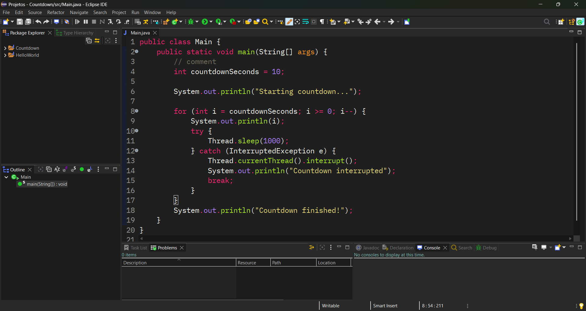

# Monokai DarkPlus for Eclipse IDE

For easy install use the [Eclipse Themes](https://marketplace.eclipse.org/content/eclipse-themes) or [DevStyle](https://marketplace.eclipse.org/content/darkest-dark-theme-devstyle) extension.

#### NOTE

There is a known bug with selection background in Eclipse Themes plugin, a workaround is:

Window > Preferences... > General > Text Editors | Appearance color options > Selection background color: set red, green and blue to 85, 85, 85 or any color you like.

## Showcase

Made with [JetBrains](../JetBrains/README.md) Monokai DarkPlus theme as base.
